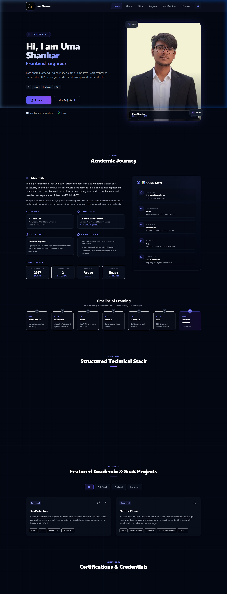

# Uma Shankar - Portfolio Website

A premium, modern, and fully responsive portfolio website built with React, Vite, Tailwind CSS, and Motion (Framer Motion). Featuring an ambient glassmorphism design, smooth micro-animations, dynamic theme switching (Dark/Light mode), and a fully functional contact form.

## 📸 Snapshots

### Dark Mode (Default)


### Light Mode


## 🚀 Features

- **Ambient UI Design**: Beautiful radial gradients, glowing effects, and a modern dark/light mode interface.
- **Micro-animations**: Smooth transitions and entry animations powered by `motion` (Framer Motion).
- **Responsive Layout**: Pixel-perfect presentation across all screen sizes (mobile, tablet, desktop).
- **Interactive Projects Gallery**: Filterable showcase of frontend/backend projects with links to GitHub repositories and live demos.
- **Academic & Skills Showcase**: Beautiful visual presentation of academic credentials and skills categorized by proficiency.
- **Certifications Showcase**: Downloadable credentials and verification links for professional certifications.
- **Interactive Contact Form**: Integrated with Web3Forms API to receive messages directly.

## 🛠️ Tech Stack

- **Core**: React 19, TypeScript
- **Bundler/Build Tool**: Vite
- **Styling**: Tailwind CSS
- **Animations**: Motion (formerly Framer Motion)
- **Icons**: Lucide React
- **Contact API**: Web3Forms

## 💻 Local Setup & Development

To run this project locally, follow these steps:

1. **Clone the repository:**
   ```bash
   git clone https://github.com/ShankarCodeHub/portfolio.git
   cd portfolio
   ```

2. **Install dependencies:**
   ```bash
   npm install
   ```

3. **Configure Environment Variables:**
   Create a `.env` file in the root directory and add your Web3Forms access key for the contact form:
   ```env
   VITE_WEB3FORMS_ACCESS_KEY=your-web3forms-access-key
   ```

4. **Run the development server:**
   ```bash
   npm run dev
   ```

5. **Build for production:**
   ```bash
   npm run build
   ```

## 📬 Contact Details

- **Email**: [shankar37337@gmail.com](mailto:shankar37337@gmail.com)
- **GitHub**: [@ShankarCodeHub](https://github.com/ShankarCodeHub)
- **LinkedIn**: [Uma Shankar](https://www.linkedin.com/in/uma-shankar-a376b6218)
